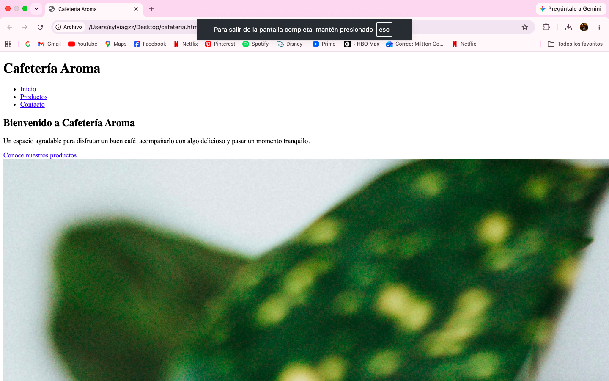
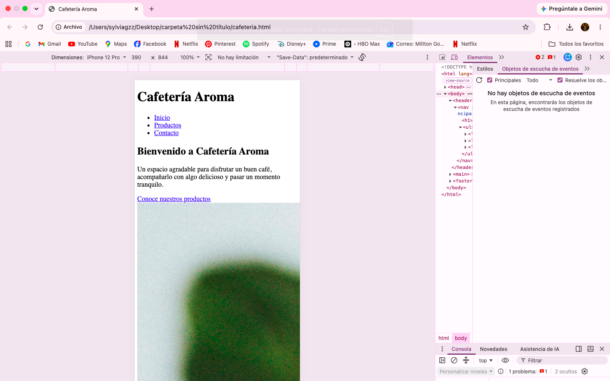

# Actividad 2 - Desarrollo de un sitio web responsivo, semántico y accesible

## Objetivo
Construir y publicar un sitio web responsivo utilizando HTML5 semántico y CSS moderno, aplicando principios básicos de usabilidad, accesibilidad y validación de estándares.

## Tecnologías Utilizadas
* HTML5 (Etiquetas semánticas: header, nav, main, section, footer)
* CSS3 (Flexbox / Grid)
* GitHub Pages para el despliegue

## Capturas de Pantalla

## Resultados de Validación W3C
* **HTML:** 
* **CSS:** 
